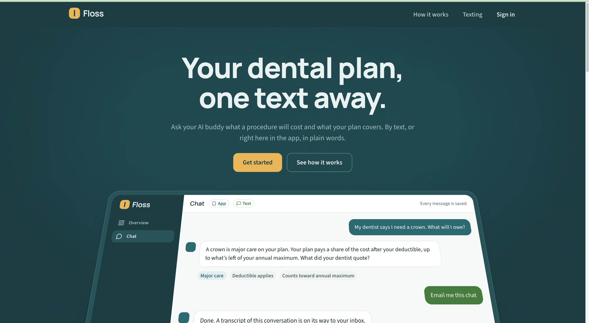
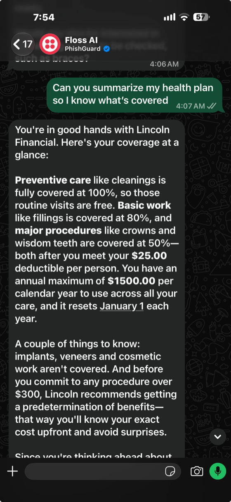
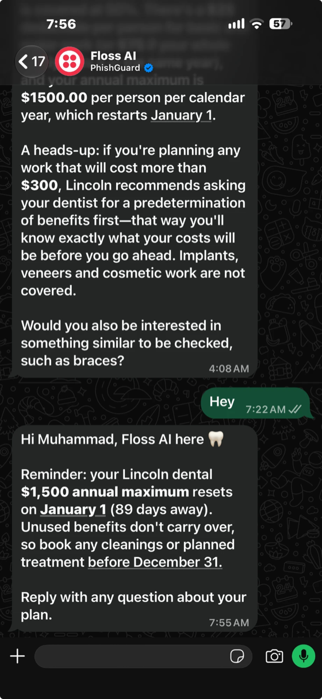
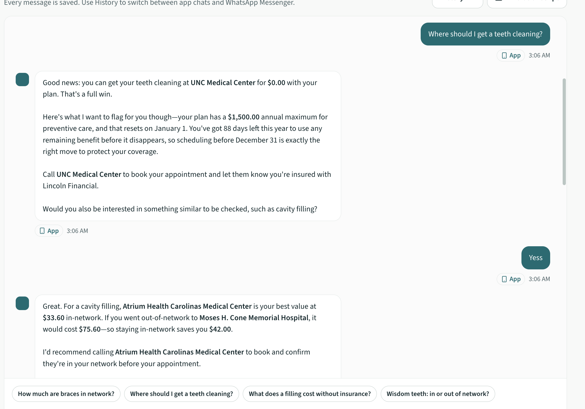
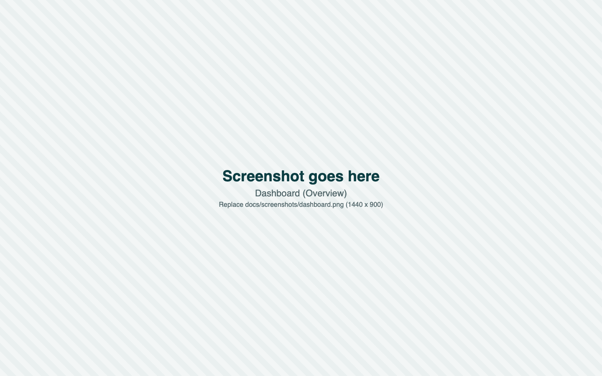
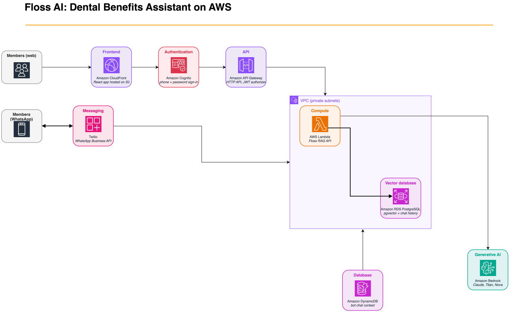

# Floss

**To run the project:** open https://d3unrkn8gkr6mk.cloudfront.net and sign in with the mobile number `+17739986828` and the password `Ashwani123`.

Floss answers an employee's dental benefits questions on WhatsApp and in a web app: what a procedure will cost, what the plan covers, and when to get care before the plan year resets. Built for codeLinc 11 (Lincoln Financial), Path 1.



<!-- Replace the placeholder PNGs in docs/screenshots (hero, chat, dashboard, mobile) with real captures. Keep the file names. -->


## The problem

A dental plan is written in insurance terms: deductible, coinsurance, annual maximum, network. Most people can't turn that into a dollar figure for a crown or braces, so they overpay, skip care, or lose their benefits when the plan year resets.

Floss answers the question people actually have, "what will this cost me, and when should I do it?", in the app they already use. Every chat is saved.

## On WhatsApp

Ask for a plan summary, or get a reminder before benefits reset.

<p>
  
  &nbsp;
  
</p>

## In the web app






## Architecture



The editable source is [`architecture.drawio`](docs/architecture/architecture.drawio). Open it at [diagrams.net](https://app.diagrams.net), edit, and export as SVG over `architecture.svg`. Steps 1 to 4 are marked on the diagram.

1. The person signs in with Amazon Cognito and asks in the web app. WhatsApp messages come in through a signed Twilio webhook on the same API.
2. API Gateway checks the JWT (or Twilio's signature) and hands the request to the API Lambda.
3. The Lambda takes the phone number from the verified token, never from the request. It replays the last 20 messages as context and searches pgvector for that person's rows.
4. Bedrock does the language work. One Claude Haiku 4.5 call picks the person and treatment. Code then looks up the stored estimates and does the arithmetic. A second call writes the reply from those facts. Titan Text Embeddings v2 handles the search.
5. Every dollar figure, email address, phone number and link in the reply must be one of the facts. If one isn't, the writer gets one retry, and after that code writes the reply. The Lambda saves both messages and returns the answer.

In the diagram, WhatsApp goes through the signed route on the API. Today the bot Lambda in `backend/whatsapp-chatbot` sits in step 1 instead and calls the RAG function directly. The route on the branch above would move it onto the API.

The six ideas behind it:

- RAG: the model answers from rows retrieved for that person, and from facts code builds from them, not from memory.
- Context: each turn replays the last 20 messages, so "and for my son?" makes sense.
- REST API: one versioned `/v1` API on Amazon API Gateway serves the web app and WhatsApp. Its shapes are zod schemas in `packages/contracts`.
- Cognito authentication: sign-in with a mobile number and password. API Gateway validates the token on every app route.
- Multilingual: Claude and Titan both handle many languages. Titan is tuned for English, so the plan is to translate the question before searching.
- WhatsApp encryption: WhatsApp encrypts messages end to end between the phone and the WhatsApp Business API that Twilio runs. From Twilio to our API they travel over HTTPS, and we check Twilio's signature on every call.

## What works today

Live on AWS:
- The web app on CloudFront and S3, with sign-in, chat, chat history and family member cards
- API Gateway and a Lambda behind it, with a Cognito authorizer
- Chat answers from the picker and writer pipeline in `backend/rag`, tested offline with `python3 -m unittest backend/rag/test_advisor.py`
- Postgres with pgvector: 20 treatment estimates (4 people, 5 conditions), 30 NC hospitals with contact details, 30 NC dental costs, users and chat history
- The Floss AI WhatsApp bot in `backend/whatsapp-chatbot`: Twilio calls a Lambda that introduces Floss AI and sends questions from registered numbers to the same RAG function, so each answer comes from that member's own rows

- A signed Twilio webhook route (`POST /v1/twilio/sms`) inside the API Lambda, so WhatsApp and SMS can use the same API as the web app. Today the bot calls the RAG function directly.


The stored estimates use a simple allowed amount (80% of the cash price). The advisor corrects braces for the lifetime orthodontic limit and warns about the annual maximum, but only for those five treatments.

## Try it

On the live site, sign in with the account at the top of this page. Open **Chat** and ask `How much are braces in network?`, then `and for my son?`. For WhatsApp, message Floss from a registered phone (ask Ashar for the sandbox join code).

To run it on your machine with sample data and no backend, you need Node 20.19 or newer:

```bash
npm install
npm run dev
```

Open http://127.0.0.1:5173, choose **Get started**, and sign up with any email and a password of 12 or more characters. The **Demo** button at the bottom right switches between six real plans (Lincoln, Delta Dental, Aetna, MetLife Standard and High, Cigna) and between a family and one person.


## Repository

| Path | What is in it |
| --- | --- |
| `apps/web` | The React app: React 19, Vite, TypeScript, Tailwind v4, Motion, TanStack Query |
| `packages/contracts` | The API contract (zod), plan fixtures from five carriers' PDFs, JSON Schema |
| `backend/rag` | The API Lambda, the picker and writer pipeline, tests, deploy script, CloudFormation |
| `backend/whatsapp-chatbot` | The WhatsApp bot Lambda |
| `infra` | CloudFormation for the website |
| `db`, `scripts` | SQL tables, loaders, Cognito user and deploy scripts |
| `docs` | Architecture diagram and screenshots |
| `md-files` | Specs, build brief, backend record and operations notes |

## Team

| Name | Built |
| --- | --- |
| Ashmit Mishra | Web app, design, API contract |
| Ashwani Mishra | AWS backend: database, RAG, API, sign-in, hosting |
| Muhammad Ashar Mian | WhatsApp implementation |
| Ibrahim Jimi | System design |

`main` must always work, so changes go through pull requests. Specs live in [`md-files`](md-files): start with `BUILD-BRIEF.md`.
