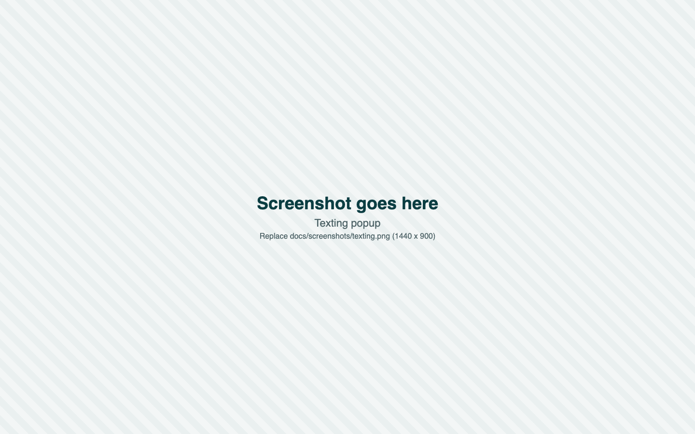

# Floss

**Floss is a dental benefits assistant you can text.** It tells an employee what their group dental plan pays, what they owe, and when to schedule care, in plain words. Built for codeLinc 11 (Lincoln Financial), Path 1.

**Live site: https://d3unrkn8gkr6mk.cloudfront.net** (sign in with the mobile number on your plan; see [Try the live site](#try-the-live-site))


<!-- Replace the placeholder PNGs in docs/screenshots/ with real captures. Keep the file names. -->

Demo video: _link goes here_

## The problem

A dental plan is written in insurance language: deductible, coinsurance, annual maximum, frequency limit, waiting period, network. Most employees cannot turn that into a dollar figure for a crown or braces, so they overpay, skip care, or let benefits expire on the reset date.

Floss answers the question the employee actually has ("what will this cost me, and when should I do it?") in a web app and, next, on WhatsApp. Every chat is saved, and the transcript can be emailed.

The design uses RAG over the patient's own data, conversation context, a REST API, Cognito authentication, multilingual answers, and WhatsApp's end-to-end encryption.

## Architecture


The editable source is [`architecture.drawio`](docs/architecture/architecture.drawio). Open it in [diagrams.net](https://app.diagrams.net), edit, and export as SVG over `architecture.svg`.

### How one question travels

1. The plan holder signs in with Amazon Cognito and asks in the web app. WhatsApp messages will arrive through a signed Twilio webhook on the same API.
2. API Gateway checks the JWT (or Twilio's signature) and passes the request to the API Lambda. Each call has a limit of about 29 seconds.
3. The Lambda takes the phone number from the verified token, never from the request. It loads the last 6 messages of the conversation as context and searches pgvector for rows that belong to that phone number only.
4. Bedrock does two jobs: Titan Text Embeddings v2 embeds the question for the search, and Claude Haiku 4.5 explains the rows. If the reply contains a dollar amount that is not in the rows, the Lambda returns a safe fallback instead.
5. The Lambda saves both messages to the chat ledger and returns the reply. The web app shows it, or Twilio sends it back on WhatsApp.

Money math, such as what the plan pays for a crown, belongs in the cost engine in integer cents. The model explains results and never adds numbers.

### Key ideas

- **RAG.** Retrieval-augmented generation. The model answers from rows retrieved from the database for that patient, so prices come from data and not from the model's memory.
- **Context.** Each turn carries the last 6 messages of the conversation, so "what about braces?" after a question about a filling means something.
- **REST API.** One versioned `/v1` REST-style HTTP API on Amazon API Gateway serves the web app and, next, WhatsApp. Its shapes are defined as zod schemas in `packages/contracts`.
- **Cognito authentication.** Amazon Cognito signs people in with their mobile number and a password. The accounts are created by the team. API Gateway validates the Cognito ID token on every app route.
- **Multilingual.** Claude Haiku 4.5 reads and writes many languages. Titan Text Embeddings v2 supports 100+ languages but is tuned for English, so the plan is to translate the question to English before the search and answer in the user's language.
- **WhatsApp encryption.** WhatsApp encrypts messages end to end between the user's phone and the WhatsApp Business API that Twilio runs. From Twilio to our API they travel over HTTPS, and we will verify Twilio's signature on every webhook call.

### Security

| Layer | Control |
| --- | --- |
| Web users | Cognito sign-in (mobile number and password), JWT checked by an API Gateway authorizer on every app route |
| WhatsApp | Twilio's `X-Twilio-Signature` verified on the webhook, and messages accepted only from a number that has an account (planned) |
| Data access | The phone comes from the token. Every vector search is filtered by it, so a patient reads only their own rows. |
| Database | IAM authentication (no stored password), a least-privilege `api_app` role, encrypted at rest, inside a VPC |
| Model access | Bedrock is reached through a private VPC endpoint |
| In transit | TLS 1.2 or newer to API Gateway, Cognito and the database. The site is served over HTTPS with HSTS and a content security policy. |

### What is built

| Component | Status | Notes |
| --- | --- | --- |
| Web app (`apps/web`) | Live | Hosted on CloudFront and a private S3 bucket. Sign-in, chat and chat history use the real API. Plan rules and usage on the Overview page are still sample data. The same code runs locally on sample data. |
| API contract (`packages/contracts`) | Built | zod schemas, JSON Schema export, and fixtures for six plans from five carriers' PDFs. |
| API Gateway and API Lambda (`backend/rag`) | Live | HTTP API with a JWT authorizer, throttled to 10 requests per second. Routes: `GET /v1/me`, `GET /v1/conversations`, `GET /v1/messages`, `POST /v1/turns`, `GET /v1/turns/{id}`. |
| Cognito | Live | Mobile number and password. Accounts are created by the team. There is no sign-up. |
| Chat history | Live | `users` and `chat_messages` tables, threads with a "New chat" option, last 6 messages sent as context. |
| RAG | Live, tested | Braces for one patient returns $2686.40 exactly. A filling with no price on file returns "manual verification needed" and no number. |
| Bedrock | Live | Titan Text Embeddings v2 and Claude Haiku 4.5, reached over a VPC endpoint. |
| Postgres + pgvector on RDS (`db/`, `scripts/`) | Live | 1024-dimension vectors, cosine HNSW index. 20 treatment rows (4 people, 5 conditions), plus tables for patients, 30 NC hospitals and 30 NC dental costs. Plan PDF chunks are not loaded yet. |
| Cost engine | Stand-in only | A tested calculator inside the web app's sample-data mode (15 tests). The backend version is not written. |
| Plan parsing | Planned | The web app ships the parsed result for six plans. The pipeline that produces it from a PDF is not built. |
| Twilio WhatsApp | Planned | Nothing sends WhatsApp messages yet, so WhatsApp history is empty. |
| Multilingual | Planned | The models support it. The Lambda does not detect or translate languages yet. |
| Phone linking, confirming actions, transcript email | Planned | The API answers "not available yet". SES and SNS are in sandbox in the workshop account. |

## Screens


Chat. Floss answers from the patient's own treatment rows, with every dollar figure checked against those rows.


Dashboard. Annual maximum used and left per family member, reminders, and the plan on file.



Texting. Link a phone with a one-time code and the same conversation continues by message.


The same screens on a phone.

## What it does

The first three rows are the challenge's required asks. The last three are its bonus asks.

| Ask | How Floss answers it | Status |
| --- | --- | --- |
| Describe a planned procedure, with plan details | Plan already on file; the user describes the procedure in chat | Live (RAG rows), sample data (plan rules) |
| Translate insurance language into what is covered and owed | Chat answer that says what each option costs and why | Live (RAG rows). Estimate cards use sample data. |
| Sequence care across the plan year | Sequence card in chat that compares doing treatments before or after the reset | Sample data |
| Track annual maximum usage | Per-person meters on the dashboard | Sample data |
| In-network vs out-of-network | In-network and out-of-network cost and hospital for each treatment | Live |
| Remind before benefits expire | Reminders 60, 30 and 14 days before the plan year ends, per person | Shown in the app, sending is planned |

Also in the app: a saved chat history with separate threads, and a household with more than one person.

## Try the live site

1. Open https://d3unrkn8gkr6mk.cloudfront.net and choose **Sign in**.
2. Enter the mobile number on your plan, with the country code, and your password. Accounts are created by the team, so ask Ashwani for yours.
3. Open **Chat** and ask `How much are braces in network?`. Use **History** to switch threads or start a **New chat**.
4. Open **Overview** for your household and the Lincoln sample plan.

If the page has no password box, hard refresh. Troubleshooting and admin steps are in [`md-files/backend-ops.md`](md-files/backend-ops.md).

## Try it with sample data

Five minutes, no backend needed.

1. Run the app (see [Run it locally](#run-it-locally)) and scroll the landing page. The app card tilts flat as you scroll.
2. Choose **Get started** and sign up with any email and a password of 12 or more characters.
3. On the dashboard, Jordan has used $244 of a $1,500 annual maximum.
4. Open **Chat** and ask `What will a crown cost me?`. Floss asks for your dentist's quote. Reply `He quoted $1,200`. The plan pays $600 and you pay $600.
5. Type `Leo had a filling, the bill was $180`. Confirm the card, then check the dashboard: Leo's meter moved.
6. Choose **Connect texting**, get a code, and use the demo button to pretend you sent it.
7. Open the **Demo** button (bottom right). Switch the plan to Cigna and ask about braces: Floss says the plan does not cover orthodontics. Switch to **Just me** to see the one-person layout.
8. In **Chat**, choose **Email transcript** in the header.

The braces example from the judges: on the Lincoln plan, braces are covered up to a $1,500 lifetime maximum for children. That maximum does not reset, so splitting the work across December and January saves nothing, and Floss says so.

## Run it locally

You need Node 20.19 or newer.

```bash
npm install
npm run dev
```

Open http://127.0.0.1:5173. To check the code:

```bash
npm run typecheck && npm test && npm run build
```

`VITE_DATA_MODE=mock` (the default) uses built-in sample data and accepts any email and password. To use the live backend, copy `apps/web/.env.example` to `apps/web/.env.local` and set `VITE_DATA_MODE=live`. Sign-in then uses the real accounts.

## How the numbers stay correct

- **The model never does arithmetic.** Money is integer cents and the math runs outside the LLM. The API Lambda checks every dollar figure in a reply against the rows it retrieved.
- **No invented prices.** Floss uses the dentist's quote or a stored row. With neither, it asks or says a manual check is needed.
- **Plan rules cite their source.** Each fact can carry the PDF page it came from. A fact the summary does not state shows as "not listed in your plan summary", never as a guess.
- **A patient sees only their own rows.** The vector search is filtered by the phone number in the verified token.
- **Responses are validated.** The live adapter parses every response with the contract's zod schemas and rejects anything that does not match.

## Tech stack

| Layer | Choice |
| --- | --- |
| Web app | React 19, Vite 7, TypeScript (strict), Tailwind CSS v4, Motion, TanStack Query, React Router 7 |
| Contract | zod 4 schemas in `packages/contracts`, exported as JSON Schema |
| AI | Amazon Bedrock: Claude Haiku 4.5 for answers, Titan Text Embeddings v2 for search |
| Compute | AWS Lambda (Python 3.12, arm64) |
| API and auth | Amazon API Gateway (HTTP API, JWT authorizer), Amazon Cognito |
| Data | Amazon RDS for Postgres with pgvector, IAM database authentication |
| Hosting | Amazon CloudFront and S3 |
| Infrastructure | CloudFormation: `backend/rag/template.yaml` (API) and `infra/web.yaml` (site) |
| Messaging | Twilio API for WhatsApp (planned) |

## Repository map

| Path | What is in it |
| --- | --- |
| `apps/web` | The React app |
| `packages/contracts` | API contract, plan fixtures, JSON Schema |
| `backend/rag` | API Lambda handler and CloudFormation template |
| `infra` | CloudFormation for the website |
| `db` | SQL for the patients, hospitals, cost, user and chat tables |
| `scripts` | Table loading, vector building, Cognito user and deploy scripts |
| `docs` | Architecture diagram and screenshots |
| `md-files` | Specs, build brief, backend record and operations |

## Not built yet

- Twilio WhatsApp.
- Language detection and translation in the Lambda.
- The backend cost engine. The treatment rows were computed by a script with simple assumptions (an allowed amount of 80% of the cash price, no deductible, no annual maximum, no orthodontic lifetime cap). The engine will replace them.
- A pipeline that parses carrier PDFs into the contract's plan format, and an API that serves plan rules and usage. The live Overview page shows the Lincoln sample plan.
- Linking a phone for texting, confirming actions, and emailing a transcript.

## Team

| Name | Built |
| --- | --- |
| Ashmit Mishra | Web app, design, API contract |
| Ashwani Mishra | AWS backend: database, RAG, API, sign-in, hosting |
| Muhammad Ashar Mian | WhatsApp implementation |
| Ibrahim Jimi | System design |

## Contributing

`main` must always work, so changes go through pull requests from a feature branch. Run the type check, tests and build before you commit. Specs live in [`md-files`](md-files): start with `BUILD-BRIEF.md`, then `CONTEXT.md`, `FRONTEND.md` and `BACKEND.md`.
