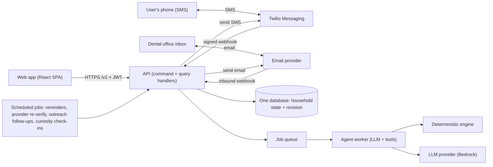

# Floss — overall context (read this first)

Version 3 · October 3, 2026 · CodeLinc 11, Path 1 (Dental)

This is the single source of truth for **what** we are building and **why**. Two companion files say **how**:

- `md-files/FRONTEND.md` — design system, Figma/MCP workflow, motion, screens, client architecture.
- `md-files/BACKEND.md` — stack-agnostic backend structure and the exact API contract the client depends on.

It replaces the earlier ChatGPT pack (`product-brief.md`, `build-and-deploy.md`, `agent-handoffs.md`) and the Claude doc. Their content is reused here except where this file says otherwise (see §9).

---

## 1. One paragraph

**Floss is a family dental-benefits assistant you can text.** A plan holder tells it, by text message or in the web app, what the dentist or orthodontist recommended for anyone in the family. Floss answers in dollars:

- what the plan pays and what the family pays, with the plan rule behind each number;
- when to schedule each treatment so the family pays least;
- whether the dentist is still in network.

It can also email the dental office to request the appointment and confirm the price, and follow up. It remembers the family and their dentists. It keeps the full conversation history, which it can email as a transcript, and it checks in on its own before benefits expire.

## 2. Who and what problem

- **User:** an employee with a Lincoln-style group dental PPO who covers a household (self, spouse, kids).
- **Problem:** plan documents are written in insurance language (deductible, coinsurance, annual max, frequency limits, waiting periods, network). People can't turn them into a dollar figure or a schedule, so they overpay, skip care, or let benefits expire on the reset date.
- **Not in scope:** claims adjudication, real Lincoln accounts, diagnosis, booking systems, HR/admin portal, native iOS app. All data in the demo is synthetic and labeled as such.

## 3. What the challenge asks, and our feature for each

| Source | Ask | Our feature |
| --- | --- | --- |
| Slide, required 1 | Describe a planned procedure and current plan details | Plan setup (demo plan or manual) + plain-language procedure intake for any family member |
| Slide, required 2 | Translate insurance language into what's covered and what you owe | Itemized estimate with a plain-English reason per line |
| Slide, required 3 | Sequence care across the plan year | Care timeline that compares schedules across the plan-year reset |
| Slide, bonus 1 | Track annual max usage | Per-member and family usage meters, visit history |
| Slide, bonus 2 | In vs out of network | Network comparison + **continuous provider network re-verification** |
| Slide, bonus 3 | Remind before benefits expire | Opt-in reminders by text and in-app, per member |
| Judge 1 | Save text history, offer an emailed transcript, save memory | Permanent cross-channel history; "Email me the transcript"; household memory the user can view and delete |
| Judge 2 | Demo: upper braces in December, lower braces in January | The primary demo scenario (§6) |
| Judge 3 | Re-verify the dentist's network status and update prices | Provider verification job + re-pricing of saved estimates on change |
| Judge 4 | Bot is proactively curious and asks questions | Curiosity policy: one targeted follow-up per turn + scheduled check-ins |
| Judge 5 | Bot emails the office for appointment + price confirmation, with follow-up | Outreach email threads: draft → user approves → send → follow-up → parse reply |
| Judge 6 | Dataset has family members; e.g. "does your kid need a cleaning?" | Household with members; per-member benefits; member-specific nudges |

## 4. Features, exact behavior

Each feature is defined once here. FRONTEND.md and BACKEND.md implement it.

1. **Household + plan setup.**
    - Pick the synthetic demo household or enter details by hand: members, plan rules, this year's usage so far.
    - Unknown rules stay visibly "unknown"; estimates that depend on them are marked *incomplete*.
2. **Estimate.**
    - Input: member, procedure(s), date, provider, quote/allowed amount, network.
    - Output: eligibility, billed, allowed, deductible applied, insurer pays (before/after the annual cap), you pay, out-of-network balance bill, and a reason per line.
    - A deterministic engine does all the math; the AI never does arithmetic.
3. **Care timeline.**
    - Input: recommended procedures with dependencies and earliest/latest dates. Postponing is allowed **only** if the user says the dentist approved it.
    - Output: baseline cost, best valid schedule, difference, dated steps and the rule behind the difference.
    - Never suggests delaying urgent care.
4. **Usage tracking.**
    - Per member: annual max used/remaining, deductible, frequency counts (e.g. cleanings 1 of 2). Per family: the deductible cap.
    - *Actual* (recorded visits), *projected* (saved plans) and *pending* (unconfirmed) are always visually distinct.
    - Saving a plan never moves the actual meter.
5. **Visits.** Recorded from the app or by text. Preview → confirm → saved, with source shown (App / Text / Email). Corrections are reversal events, never silent edits.
6. **Text messaging (Twilio SMS).**
    - Link: the app shows "Text `JOIN <code>` to +1 …", and the inbound sender becomes the linked phone after the user confirms in the app.
    - Then any question works by text, with the same agent, history and data.
    - Writes need `CONFIRM <token>`.
    - `STOP` / `START` / `HELP` are honored.
7. **History, transcript, memory (judge 1).**
    - Every message on every channel is stored permanently in one household thread, viewable and searchable in the app.
    - "Email me the transcript" (app button, or ask by text) emails a dated transcript to the user's verified email.
    - **Memory:** durable facts the assistant learns ("Maya's orthodontist is Dr. Patel", "prefers mornings"). Each is stored with its source message and shown in Settings → *What Floss remembers*, where it can be deleted.
8. **Provider network re-verification (judge 3).** Each provider has `networkStatus` (in / out / unknown) and `lastVerifiedAt`. It is re-checked:
    - daily;
    - before any estimate when the last check is older than 24 h;
    - on demand.

    On a change, affected saved estimates and care plans are re-priced, and the user is notified with old → new numbers.
9. **Office outreach email (judge 5).**
    - The assistant drafts an email to the provider's office: requested appointment windows, procedures and codes, a request for written price confirmation or a pre-treatment estimate, and insurance info. It does not include SSN or member ID unless the user adds them.
    - The user approves (app button or `CONFIRM <token>` by text) → sent → follow-up after 2 business days if no reply (max 2 follow-ups).
    - Replies are parsed into a summary ("Offered Dec 18 10:00; confirmed $2,350") and the user is notified.
10. **Proactive curiosity (judge 4).**
    - In conversation: at most one targeted follow-up question per reply, only when the answer changes a number or a recommendation, or fills a known profile gap.
    - Scheduled check-ins: after a planned appointment ("How did Leo's cleaning go?"), when a member becomes eligible again, or when benefits are about to reset.
    - Quiet hours, opt-in and one proactive message per day are enforced.
11. **Reminders.** A daily evaluator creates per-member, deduplicated notifications ("Leo has 1 covered cleaning left in 2026"). They are delivered in-app and by text if opted in. Delivery state is never faked.
12. **Network compare.** Same member, procedure and date priced in and out of network, including the balance bill.

## 5. What the AI does, exactly

One agent serves every channel (app chat, SMS, inbound email summaries). Each turn:

1. **Interpret** the intent.
2. **Clarify**, asking at most one question when it changes the answer.
3. **Retrieve** household context and memory through tools.
4. **Calculate** only through engine tools.
5. **Explain** the result in plain words. Numbers are inserted from tool results, never written by the model.
6. **Propose** writes as *pending actions*. Only an explicit confirmation commits them.

| Job | Example | Tools |
| --- | --- | --- |
| Price care | "Maya needs braces, upper and lower, $2,400 each. What do we owe?" | `get_household_context`, `estimate_cost` |
| Plan timing | "Can we split them across the reset?" | `sequence_care` |
| Compare network | "What if Bright Smiles leaves the network?" | `compare_network_costs`, `check_provider_network` |
| Track usage | "Leo had his cleaning today" | `prepare_action(record_visit)` |
| Contact office | "Ask them for December and January slots and confirm the price" | `draft_outreach_email` → `prepare_action(send_outreach_email)` |
| Remember | "Maya's orthodontist is Dr. Patel" | `remember_fact` |
| Transcript | "Email me this conversation" | `prepare_action(email_transcript)` |
| Explain the plan | "What's a deductible?" | `get_household_context` (plan rules + glossary) |

**Hard rules:**

- No diagnosis.
- Never recommend delaying care the dentist didn't approve delaying.
- No invented fees.
- The `userId` is never accepted from the model.
- Off-topic requests get a polite redirect.

## 6. The demo (synthetic, numbers verified by hand)

**Household:** the Riveras.

- Jordan (subscriber, 38), Sam (spouse, 37), Maya (14), Leo (8).
- Providers: Maple Family Dental (general) and Bright Smiles Orthodontics (Dr. Ana Patel). Both are in network at the start of the demo.

**Sample Family PPO** (synthetic, labeled *not a real Lincoln plan*):

- Calendar plan year.
- Annual max $1,500 per person.
- Deductible $50 per person, $150 family cap.
- Preventive 100%, exempt from both the deductible and the max; cleanings 2 per plan year.
- Basic 80%; major 50%.
- Orthodontics 50% for members under 19, no deductible, **counts toward the member's annual max** (demo rule).

**2026 usage at demo time:**

- Jordan $1,200 used ($300 left, deductible met).
- Sam $0.
- Maya $0 used ($1,500 left), 2 of 2 cleanings.
- Leo $0 used, **1 of 2 cleanings**.

**Story:**

1. **Text:** "Maya's orthodontist says she needs braces, upper and lower, $2,400 each. What will we owe?"
    - Both in December 2026: plan pays min(50% × $4,800, $1,500 left) = **$1,500**; family pays **$3,300**.
    - Floss asks: "Did Dr. Patel say the lower arch can start in January?" (curiosity).
2. **Reply "yes".** The timeline shows **upper braces December 2026** (plan $1,200, family $1,200) and **lower braces January 2027** after the reset (plan $1,200 from the new max, family $1,200).
    - Total family **$2,400**; difference **$900**.
    - Assumes the same plan next year, and says so.
3. **Floss offers to email Bright Smiles** for a December upper / January lower appointment and written price confirmation. The user approves, the email lands in the office's demo inbox, and the follow-up is visibly scheduled.
4. **Network re-verification.**
    - Run the verifier with the demo toggle that marks Bright Smiles out of network. Allowed $2,000 per arch, billed $2,400.
    - Estimate re-priced: each arch plan pays $1,000, family pays $1,400 → **$2,800** (+$400). The user is notified with old → new.
    - Toggle back.
5. **Family nudge** (reminder evaluator with the demo clock): "Leo has 1 covered cleaning left in 2026 — want me to ask Maple Family Dental for a December slot?"
6. **Sync:** text "Leo had his cleaning today" → preview → `CONFIRM K7Q2` → Leo shows 2 of 2 cleanings (actual) on the dashboard within about 3 s, tagged *Text*.
7. **Transcript:** tap "Email transcript" → it arrives. Show *What Floss remembers* (Dr. Patel, Maya's ortho plan).

Engine regression fixtures from the earlier pack stay valid: Jordan's filling ($200) + crown ($1,200) with $300 left → $1,100 same year vs $665 split (difference $435).

**Open points:**

- We read judge comment 2 as dental braces split by arch across the plan-year reset.
- Real plans often use a *lifetime* ortho max and case-fee billing. Our engine supports `orthoMaxType: "annual" | "lifetime"`. The demo uses the annual sample rule and says so on screen.

## 7. Architecture (shape is fixed; the stack is replaceable)

**Fixed rules:**

- One HTTP contract (`BACKEND.md` §4). The client never touches the database or the LLM directly.
- One deterministic engine shared by the API, agent and jobs.
- Every write goes through command handlers that bump the household `revision`. The client polls `GET /v1/snapshot` every 2 s, so app ⇄ text ⇄ email stay in sync.
- Agent turns are asynchronous: `202` plus polling.
- Writes from chat or SMS are pending actions; they apply only after explicit confirmation.

**Default stack** (from the ChatGPT pack; the backend team may swap pieces if the contract holds):

- AWS: API Gateway + Lambda, DynamoDB, SQS, EventBridge Scheduler, Cognito.
- Bedrock Converse. Start with a model that actually invokes in our account: Amazon Nova works on the free plan; Claude Haiku needs a `us.` profile, which the free plan blocks, so it requires the paid plan.
- Amplify Hosting for the SPA. Twilio for SMS. SES or another provider for email.

## 8. Team

| Owner | Scope | File |
| --- | --- | --- |
| A — Ashmit | Design + frontend (`apps/web`) | FRONTEND.md |
| B | API, data, auth, deploy | BACKEND.md §1–6, §12–14 |
| C | Engine + agent | BACKEND.md §7–8 |
| D | Twilio SMS, email outreach, scheduled jobs, demo script | BACKEND.md §9–11 |

**Rules:**

- The API contract and fixtures live in `packages/contracts` and change only with A + B + C agreeing.
- Mock-first: the frontend never waits for the backend.
- Small PRs to `main`, branches `feature/<name>` (per README).

## 9. Decisions changed from earlier docs

| Topic | Earlier | Now | Why |
| --- | --- | --- | --- |
| Text channel | iMessage via a Mac bridge (imessage-kit / BlueBubbles) | **Twilio SMS** | Team decision; no Mac dependency |
| Demo | Filling + crown ($1,100 → $665) | **Braces by arch across the reset ($3,300 → $2,400)**, with filling/crown kept as engine tests | Judge comment 2 |
| Users | Single member | **Household with members** | Judge comment 6 |
| History | Last 50 messages | **Full history + email transcript + memory** | Judge comment 1 |
| Network | Static comparison | **Re-verified and re-priced** | Judge comment 3 |
| Email | None | **Office outreach + transcripts** | Judge comments 1 and 5 |

**Important Twilio facts:**

- **Twilio sends SMS, not iMessage.** On iPhones replies show as green SMS bubbles. Say "text Floss", not "iMessage Floss", in the pitch.
- **Trial account:** 100 SMS, sent only to up to 5 verified phone numbers. US A2P 10DLC registration needs a paid account.
- Use the trial for the demo phones. Test mostly with the local SMS simulator (BACKEND.md §9) to save messages.

## 10. Open questions

- [ ] Deadline and demo format (live or video)?
- [ ] AWS account: free or paid plan? This decides Nova vs Claude.
- [ ] Twilio: trial (5 verified numbers) or paid (needs 10DLC registration, which takes days)?
- [ ] A domain we control for inbound email replies? Without one, office replies are pasted in manually (BACKEND.md §10).
- [ ] Confirm the judge-2 reading (braces by arch).

## 11. Sources

- Twilio US trial limits: https://www.twilio.com/docs/messaging/guides/how-to-work-with-your-twilio-free-trial-account-us-only
- AWS free-plan service limits (no cross-region inference): https://docs.aws.amazon.com/accounts/latest/reference/supported-services-sign-up-new.md
- Bedrock Claude Haiku 4.5 (inference profile required): https://docs.aws.amazon.com/bedrock/latest/userguide/model-card-anthropic-claude-haiku-4-5.html
- FAIR Health consumer dental estimator: https://www.fairhealthconsumer.org/dental
- Lincoln dental health library: https://ohl.go2dental.com/oral-health?cli=lincoln&sm=5
